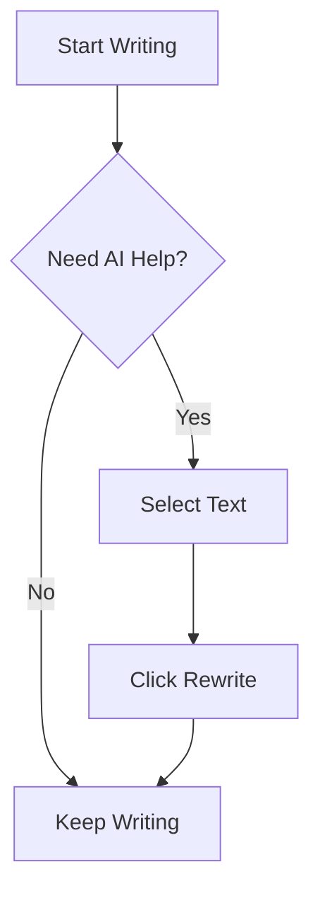

# Welcome to Markdown AI Studio

Start writing your markdown here. Use the **AI features** to enhance your content.

## Features

- **AI Rewrite**: Select text and click "Rewrite" to enhance it with AI
- **AI Generate**: Click the AI button to generate content at cursor position
- **Live Preview**: See your markdown rendered in real-time
- **Mermaid Diagrams**: Use `mermaid` code blocks for diagrams
- **Draw.io**: Use `drawio` code blocks for embedded diagrams

## Example Mermaid Diagram

## Example Table

| Feature | Status |
|---------|--------|
| Monaco Editor | ✅ |
| Markdown Preview | ✅ |
| AI Rewrite | ✅ |
| AI Generate | ✅ |
| Mermaid Diagrams | ✅ |
| Draw.io Support | ✅ |

> **Tip:** Open Settings to configure your GCP project and AI model preferences.
